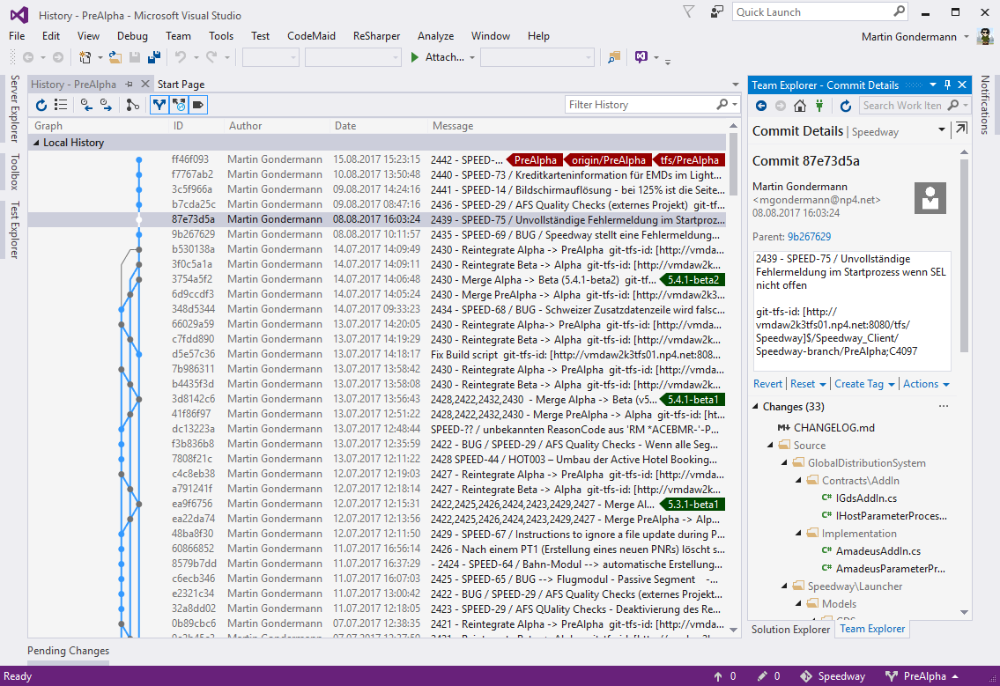
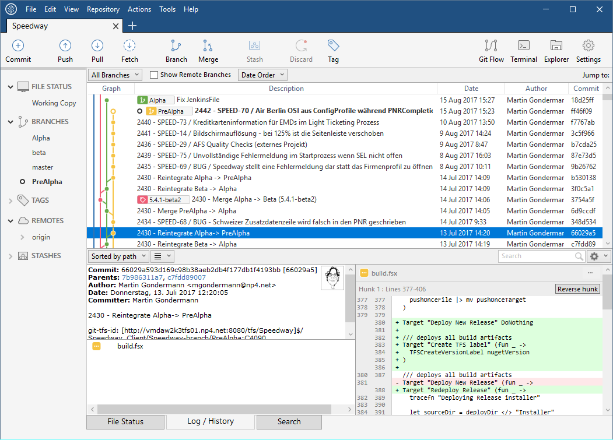
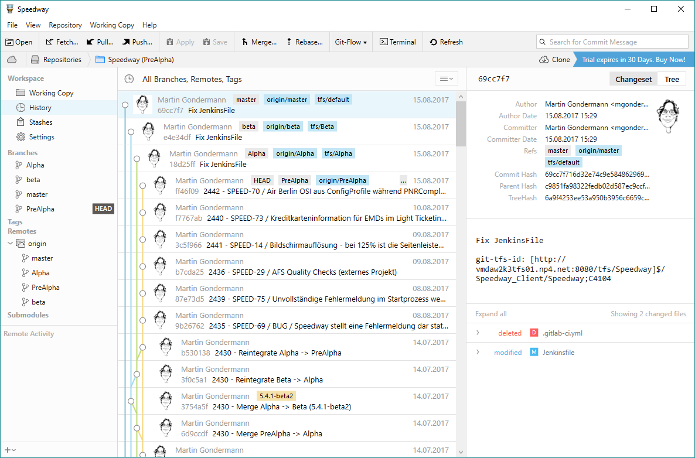
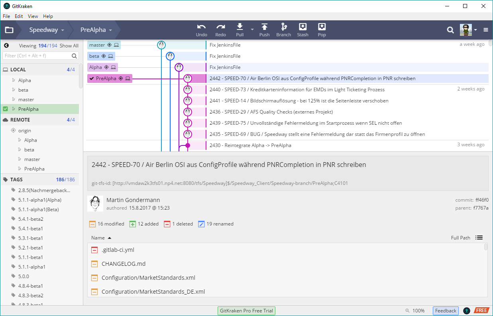
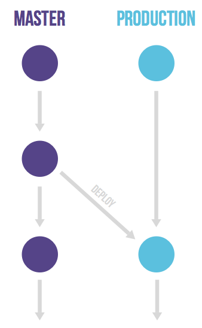
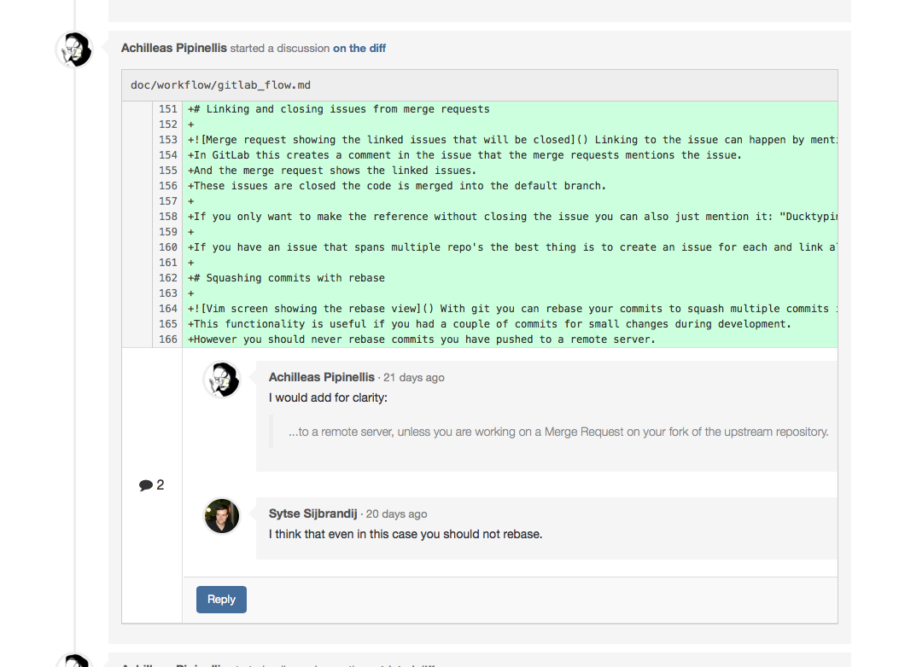

- title : Git für TFS Benutzer
- description : Einführung in Git und GitLab
- author : Martin Gondermann
- theme : beige
- transition : slide

***

## Git für TFS Benutzer

 
 

### Einführung in Git und GitLab

 
 
Martin Gondermann - [@magicmonty](http://www.twitter.com/magicmonty)

***

### TLDR

#### Vergleich TFS ↔ Git

| TFS           | Git                          |
| ------------- | ---------------------------- |
| Zentralisiert | Verteilt                     |
| Workspace     | Repository (aka. "Repo")     |
| Changeset     | Commit hash                  |
| Code Review     | Merge- oder Pull-Request  |

---

### TLDR

#### Vergleich TFS ↔ Git

| TFS             | Git                       |
| --------------- | ------------------------- |
| Get Latest    | `clone` (1. mal) bzw. `pull` |
| Check in        | `git commit` & `git push` |
| Check out       | Nicht notwendig           |
| Pending changes | `git status`              |

---

### TLDR

#### Vergleich TFS ↔ Git

| TFS       | Git                   |
| --------- | --------------------- |
| Branch    | Branch - `git branch` |
| Label     | Tag - `git tag`       |
| Shelveset | Stash - `git stash`   |
| Merge     | Merge - `git merge`   |

***

### Zentralisiert vs. Verteilt

#### Zentralisiert

---

### Zentralisiert vs. Verteilt

#### verteilt

***

### Snapshots vs. Deltas

#### TFS - Deltas

' Der Hauptunterschied zwischen Git und anderen VCS (Subversion and friends included) ist die Art in der Git seine Daten sieht.
' Die meisten anderen System speichern Informationen als eine Liste von Datei-basierten Änderungen.
' Diese Systeme betrachten die Informationen als eine Menge von Dateien und den Änderungen, die auf jeder Datei über die Zeit gemacht werden.

---

### Snapshots vs. Deltas

#### Git - Snapshots

' Git betrachtet seine Daten eher als einen Strom von Snapshots eines Miniatur-Dateisystems.
' Jedesmal, wenn man commited, macht Git einfach gesagt ein Snapshot des aktuellen Zustands aller Dateien zu diesem Zeitpunkt und speichert eine Referenz.
' Um effizient zu sein, speichert Git nicht geänderte Dateien nicht, sondern nur einen Link zur vorhergenden identischen Version.

***

### Commit vs. Check in

* **TFS:**
  * Check in sendet geänderte Daten an den Server
  * ein lokaler Commit ist nicht möglich
* **Git:**
  * `commit` speichert Änderungen im lokalen Repository
  * `push` sendet die Änderungen im lokalen Repository an den Server

***

### Branching

#### TFS

* Branch wird auf dem Server erstellt
* Branch wird dann in einem extra Verzeichnis auf den lokalen Rechner synchronisiert
* relative langsame ("teure") Operation, daher nur selten benutzt

---

### Branching

#### Git

* Branch erstellen ist nur das Setzen eines Namens auf einen Commit
* Es wird immer im selben Verzeichnis operiert.
* Branch wechseln ist sehr schnell, da nur die geänderten Dateien im Verzeichnis angepasst werden
* Wird häufig benutzt z.B. für
  * Feature-Branches (kurzlebig)
  * Bugfix-Branches (kurzlebig)
  * Release-Branches (langlebig)

***

### Git Clients

* Kommandozeile: `git` Kommando
* Eingebaut in Visual Studio / VS Code
  * nur die einfachsten Kommandos, für den normalen Betrieb aber durchaus ausreichend
* externe Grafische Clients:
  * SourceTree - https://www.sourcetreeapp.com/
  * Tower - https://www.git-tower.com/windows/
  * GitKraken - https://www.gitkraken.com/

---

### Git Clients

#### Visual Studio integriert

---

### Git Clients

#### SourceTree

---

### Git Clients

#### Tower

---

### Git Clients

#### Git Kraken

***

### GitLab

#### aka "TFS für Git"

* Zentrales Repository-Management
* CI Server (optional)
* Wiki per Projekt (optional)
* Issue-Management
  * abgeschaltet und nach JIRA umgeleitet

***

### GitLab Workflow

#### Production branch mit GitLab flow

---

### GitLab Workflow

#### Environment branches mit GitLab flow

---

### GitLab Workflow

#### Release branches mit GitLab flow

---

### GitLab Workflow

#### Andere Branching-Strategien

* Feature/CR/Bugfix-Branches
  * relativ kurzlebig
  * Werden in Release-, Environment- oder Production-Branches gemerged
  * Ersatz für ShelveSets in FAEP

---

### GitLab Workflow

#### Merge Requests / Automatischer Code Review

***
- data-background : images/demo-time.gif

***

### Danke

* https://book.git-scm.com/book/en/v2
* https://roadtoalm.com/2013/07/19/a-starters-guide-to-git-for-tfs-gitwits/
* https://about.gitlab.com/2014/09/29/gitlab-flow/
